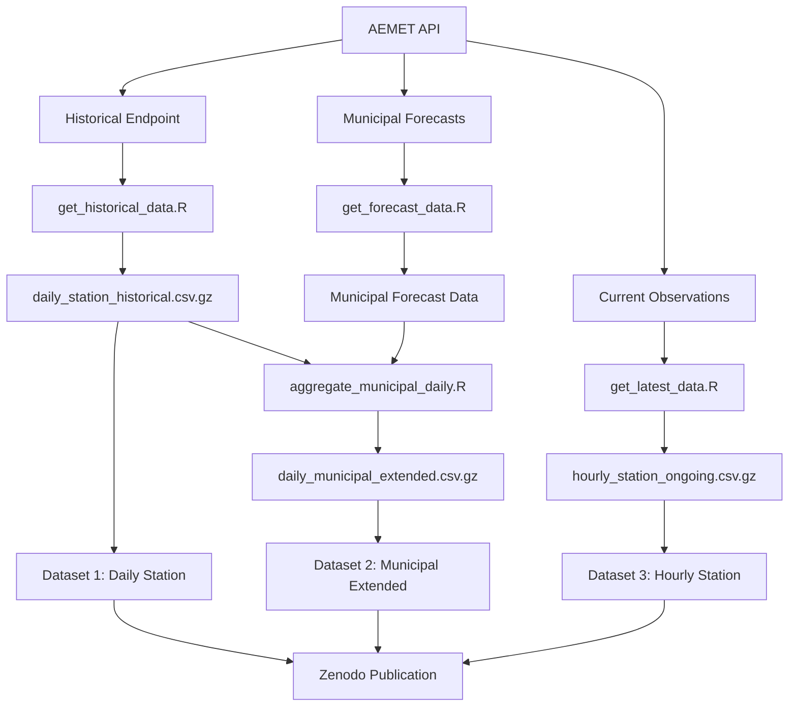
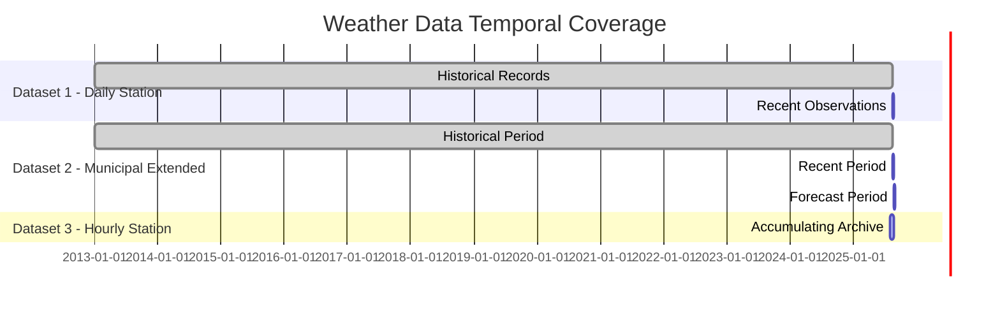

# Weather Data Collector - Spain

This repository provides scripts to download, update, and manage weather data from AEMET weather stations across Spain, producing three comprehensive datasets for analysis and research.

## Three Output Datasets

### 📊 Dataset 1: Daily Station Data (`daily_station_historical.csv.gz`)
Daily aggregated weather data by station, combining:
- Historical data from AEMET historical endpoint (2013+)
- Recent data from current observations (last 4 days)
- Variables: daily min/max/mean temperature, precipitation totals, etc.

### 🏘️ Dataset 2: Municipal Daily Data (`municipal_daily_combined.csv.gz`) 
Daily weather data by municipality (8,129 Spanish municipalities), combining:
- Station data aggregated to municipal level (historical + recent)
- 7-day municipal forecasts from AEMET
- Complete temporal coverage: historical through 7-day forecast

### ⏰ Dataset 3: Hourly Station Data (`hourly_station_observations.csv.gz`)
Hourly observations from all AEMET stations:
- Real-time collection building our own historical archive
- Expanded variable set (7 safe variables)
- Updated every 2 hours

## Data Collection Workflow



## Dataset Temporal Coverage



## Features
- **Real-time Observations**: Fetches current hourly weather from all AEMET stations
- **Historical Data**: Updates and maintains daily historical weather dataset
- **Forecast Collection**: Downloads 7-day municipal forecasts for all 8,129 Spanish municipalities
- **Variable Compatibility**: Uses consistent variables across observation, historical, and forecast data
- **Robust Error Handling**: API rate limits, timeouts, and errors managed with retry logic
- **Concurrent Run Prevention**: Configurable lockfile system prevents script conflicts
- **Data Compression**: All outputs stored in efficient CSV.gz format

## Requirements
- R (recommended version 4.0 or higher)
- API key for AEMET OpenData (see below)
- R packages: tidyverse, lubridate, data.table, curl, jsonlite, RSocrata, R.utils

## Setup
1. **API Key**: Obtain an API key from [AEMET OpenData](https://opendata.aemet.es/centrodedescargas/inicio).
2. **Auth Directory**: Place your API key as `my_api_key` in a file called `keys.R` inside an untracked `auth/` directory:
   ```r
   my_api_key <- "YOUR_API_KEY_HERE"
   ```
3. **Install Dependencies**: Install required R packages if not already present.

## Usage

### Current Weather Observations
- Run `code/get_latest_data_expanded.R` to fetch latest observations with expanded variable set (7 safe variables)
- Original script `code/get_latest_data.R` available for basic 5-variable collection
- Recommended frequency: every 2 hours

### Historical Weather Data  
- Run `code/get_historical_data.R` to update historical daily weather dataset
- Run as needed to maintain historical records

### Forecast Data Collection
- Run `code/get_forecast_data_simple.R` for robust 7-day municipal forecasts (recommended)
- Alternative: `code/get_forecast_data.R` (original enhanced version)
- Configure `SAMPLE_SIZE` for testing (e.g., 20) or `NULL` for all 8,129 municipalities
- See `docs/forecast-collection.md` for detailed configuration

### Data Analysis
- `code/variable_compatibility_analysis.R` - analyzes variable compatibility across endpoints
- `code/aggregate_daily_station_data.R` - processes daily aggregations
- `code/aggregate_municipal_data.R` - municipal-level data processing

All output files are written to the `data/` directory as compressed CSVs.

## Directory Structure
```
realtime-weather-spain/
├── auth/                  # Untracked directory for API keys
│   └── keys.R
├── code/                  # Main R scripts
│   ├── get_historical_data.R      # Historical daily weather
│   ├── get_latest_data.R          # Basic current observations (5 vars)
│   ├── get_latest_data_expanded.R # Enhanced observations (7 safe vars)
│   ├── get_forecast_data.R        # Municipal forecasts (enhanced)
│   ├── get_forecast_data_simple.R # Municipal forecasts (robust)
│   ├── variable_compatibility_analysis.R # Variable analysis
│   ├── aggregate_daily_station_data.R    # Daily aggregations
│   └── aggregate_municipal_data.R        # Municipal processing
├── data/                  # Output data files
│   ├── spain_weather.csv.gz             # Basic observations (5 vars)
│   ├── spain_weather_expanded.csv.gz    # Enhanced observations (7 vars)
│   ├── spain_weather_daily_historical.csv.gz # Historical daily data
│   ├── municipalities.csv.gz            # All Spanish municipalities (8,129)
│   └── AEMET_variable_documentation.md  # Variable reference
├── docs/                  # Documentation and analysis
│   ├── index.md                         # GitHub Pages site
│   ├── variables.md                     # Variable documentation
│   ├── api-analysis.md                  # API endpoint analysis
│   └── forecast-collection.md           # Forecast system guide
├── logs/                  # Log files and script outputs
├── renv/                  # R environment and package management
├── update_weather.sh      # Shell script for automation
├── update_historical_weather.sh
├── README.md
└── ...
```

## Notes
- The `auth/` directory is not tracked by git for security.
- Scripts are designed to be robust to API failures and rate limits.
- For more details, see comments in each script.

## License
See `LICENSE` file for details.
