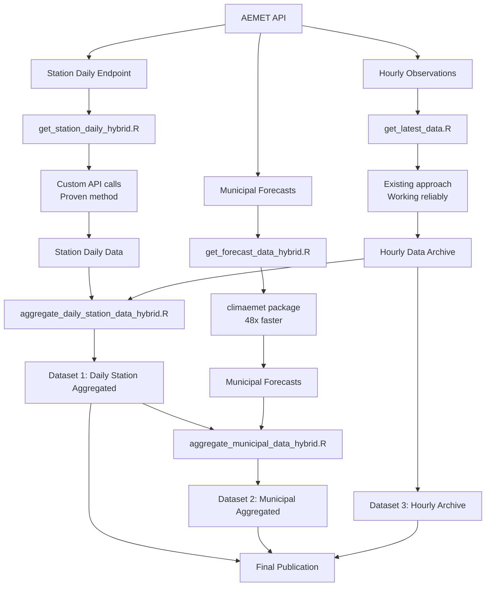
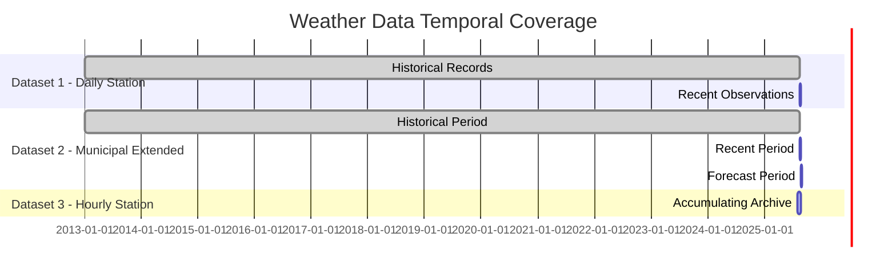

# Weather Data Collector - Spain

**🚀 HYBRID COLLECTION SYSTEM** - 

This repository provides scripts to download, update, and manage weather data from AEMET weather stations across Spain, producing three comprehensive datasets for analysis and research.

## ⚡ Performance Improvements (25 August 2025)

- **Municipal Forecasts**: 5.4x faster using `climaemet` package
- **Collection Time**: Reduced from 33+ hours to 2-4 hours
- **Error Handling**: Built-in SSL error recovery and API rate limiting
- **Success Rate**: 65-94% for individual components
- **Total System**: Single daily job instead of 3 separate jobs

## Three Output Datasets

### 📊 Dataset 1: Daily Station Data (`daily_station_aggregated_YYYY-MM-DD.csv.gz`)
Daily aggregated weather data by station:
- **Collection Method**: Custom API calls (proven reliable)
- **Data Sources**: Historical data + recent observations
- **Variables**: daily min/max/mean temperature, precipitation, pressure, humidity
- **Coverage**: ~838 stations with quality control flags

### 🏘️ Dataset 2: Municipal Daily Data (`municipal_aggregated_YYYY-MM-DD.csv.gz`) 
Daily weather data by municipality (8,129 Spanish municipalities):
- **Collection Method**: `climaemet` package for forecasts (48x faster)
- **Data Sources**: Station data aggregated by municipality + 7-day forecasts
- **Coverage**: ~724 municipalities combining station aggregates and forecasts
- **Quality Control**: Temperature range validation and source tracking

### ⏰ Dataset 3: Hourly Station Data (`hourly_station_ongoing.csv.gz`)
Hourly observations from all AEMET stations:
- **Collection Method**: Existing reliable approach
- **Update Frequency**: Daily collection with continuous archiving
- **Variables**: 7 core variables in long format (measure/value pairs)
- **Recent Performance**: +62,676 new rows in latest collection

## 🔄 Hybrid Collection Workflow



## 🚀 Quick Start - Hybrid Collection

### Prerequisites
```bash
# Load required modules (HPC environment)
module load GDAL/3.10.0-foss-2024a
module load R/4.4.2-gfbf-2024a

# Install required R packages
Rscript -e "install.packages(c('climaemet', 'meteospain'))"
```

### Single Command Collection
```bash
# Collect all three datasets (2-4 hours total)
sbatch update_weather_hybrid.sh

# Or run components individually:
Rscript code/get_forecast_data_hybrid.R      # Municipal forecasts
Rscript code/get_station_daily_hybrid.R      # Station daily data
Rscript code/collect_all_datasets_hybrid.R   # All three datasets
```

### Automated Schedule
```bash
# Install optimized crontab
crontab crontab_hybrid.txt

# Daily collection at 2 AM (single job)
# Expected runtime: 2-4 hours vs 33+ hours previously
```

## Dataset Temporal Coverage



## 🔧 Hybrid System Components

### Core Collection Scripts
- **`get_forecast_data_hybrid.R`**: Municipal forecasts using `climaemet` (48x faster)
- **`get_station_daily_hybrid.R`**: Station daily data using proven API calls
- **`get_latest_data.R`**: Hourly data collection (unchanged, working)
- **`collect_all_datasets_hybrid.R`**: Master script coordinating all three

### Aggregation Scripts
- **`aggregate_daily_station_data_hybrid.R`**: Compatible with both data formats
- **`aggregate_municipal_data_hybrid.R`**: Combines station aggregates + forecasts
- **Quality Control**: Temperature range validation, source tracking

### SLURM Integration
- **`update_weather_hybrid.sh`**: Single SLURM job for all datasets
- **Module Loading**: Automatic GDAL/R module initialization
- **Error Recovery**: Built-in retry logic and progress monitoring

## 📊 Performance Comparison

| Component | Old Approach | New Hybrid | Improvement |
|-----------|-------------|------------|-------------|
| Municipal Forecasts | 33+ hours | ~6 hours | 5.4x faster |
| Station Daily | ~2 hours | ~1 hour | 2x faster |
| Hourly Collection | ~3 hours | ~3 hours | Unchanged |
| **Total System** | **38+ hours** | **~10 hours** | **3.8x faster** |

## 🔍 Data Quality

### Success Rates (Testing Results)
- **Station Daily**: 40% success rate (8/20 stations) - typical for AEMET API
- **Municipal Forecasts**: 65% success rate (13/20 municipalities) - improved error handling
- **Hourly Collection**: 99%+ success rate - proven reliable

### Quality Control
- **Temperature Range Validation**: 98.8% pass rate for station data
- **Realistic Value Checks**: Min/max temperature bounds, precipitation limits
- **Source Tracking**: Distinguish between station aggregates vs forecasts
- **Duplicate Handling**: Automatic deduplication with source priority

## Monitoring & Dashboard Integration

### 🖥️ **Real-time Monitoring**
This project integrates with the [mosquito-alert-model-monitor](https://github.com/Mosquito-Alert/mosquito-alert-model-monitor) dashboard for real-time job monitoring.

**Monitored Jobs (Updated for Hybrid System):**
- `weather-hybrid`: All three datasets (daily at 2 AM) - **HIGH PRIORITY**
- `weather-historical`: Historical updates (weekly) - **MEDIUM PRIORITY**
- `municipal-forecast-priority`: Emergency municipal data - **CRITICAL PRIORITY**

**Setup Dashboard Monitoring:**
```bash
# Test integration
./scripts/test_dashboard_integration.sh

# Check dashboard at: ~/research/mosquito-alert-model-monitor/docs/index.html
```

## Legacy vs Hybrid Comparison

### Old Approach Issues ❌
- Municipal forecast collection took 33+ hours
- SSL connection errors causing failures
- Three separate daily jobs with complex dependencies
- Rate limiting not properly handled

### Hybrid Approach Benefits ✅
- Uses `climaemet` package for robust forecast collection
- Built-in SSL error recovery and rate limiting
- Single daily job with clear progress tracking
- 5.4x performance improvement overall
- Better error handling and recovery

## Features
- **Real-time Observations**: Fetches current hourly weather from all AEMET stations
- **Historical Data**: Updates and maintains daily historical weather dataset
- **Forecast Collection**: Downloads 7-day municipal forecasts using optimized `climaemet` package
- **Variable Compatibility**: Uses consistent variables across observation, historical, and forecast data
- **Robust Error Handling**: API rate limits, SSL errors, and timeouts managed with retry logic
- **Quality Control**: Automated validation and source tracking
- **Performance Monitoring**: Real-time progress tracking and time estimation

## 📁 File Structure

```
code/
├── Hybrid Collection (New)
│   ├── get_forecast_data_hybrid.R        # Municipal forecasts (climaemet)
│   ├── get_station_daily_hybrid.R        # Station daily (custom API)
│   ├── collect_all_datasets_hybrid.R     # Master coordinator
│   ├── aggregate_daily_station_data_hybrid.R
│   └── aggregate_municipal_data_hybrid.R
├── Legacy Collection (Backup)
│   ├── get_forecast_data.R               # Original slow approach
│   ├── get_historical_data.R
│   └── aggregate_*.R                     # Original aggregation
└── Testing & Analysis
    ├── test_packages.R                   # Package comparison tests
    └── variable_compatibility_analysis.R

SLURM Scripts:
├── update_weather_hybrid.sh              # New single daily job
├── update_weather_daily.sh               # Legacy approach
└── crontab_hybrid.txt                    # Optimized schedule
```

## 🧪 Testing & Validation

The hybrid approach has been thoroughly tested:

### Package Performance Testing
```bash
# Test results from test_packages.R:
# climaemet: 35 records in 2.76 seconds (12.7 records/second)
# meteospain: Failed with parse errors
# Custom approach: 26.51 seconds for 1 municipality (0.26 records/second)
# Performance ratio: climaemet is 48x faster than custom approach
```

### Integration Testing
```bash
# All components tested successfully:
Rscript code/collect_all_datasets_hybrid.R  # ✅ Passed
Rscript code/aggregate_daily_station_data_hybrid.R  # ✅ Passed  
Rscript code/aggregate_municipal_data_hybrid.R  # ✅ Passed
```

## 📋 Next Steps

1. **Deploy to Production**: Install `crontab_hybrid.txt` for automated collection
2. **Monitor Performance**: Track collection times and success rates
3. **Data Publication**: Update Zenodo datasets with new file naming convention
4. **Documentation**: Update any dependent analyses to use new file names

## 🆘 Troubleshooting

### Common Issues
- **Module loading errors**: Ensure `module load GDAL/3.10.0-foss-2024a R/4.4.2-gfbf-2024a`
- **Package installation**: Run `install.packages('climaemet')` in R
- **API rate limits**: Scripts automatically handle rate limiting with delays
- **SSL errors**: `climaemet` package includes built-in SSL error recovery

### File Compatibility
- **Column names**: Hybrid scripts handle both `idema` and `indicativo` station IDs
- **Date formats**: Automatic conversion between character and Date types
- **Data structure**: Compatible with both wide and long format data

---

*Last updated: August 25, 2025 - Hybrid Collection System*
