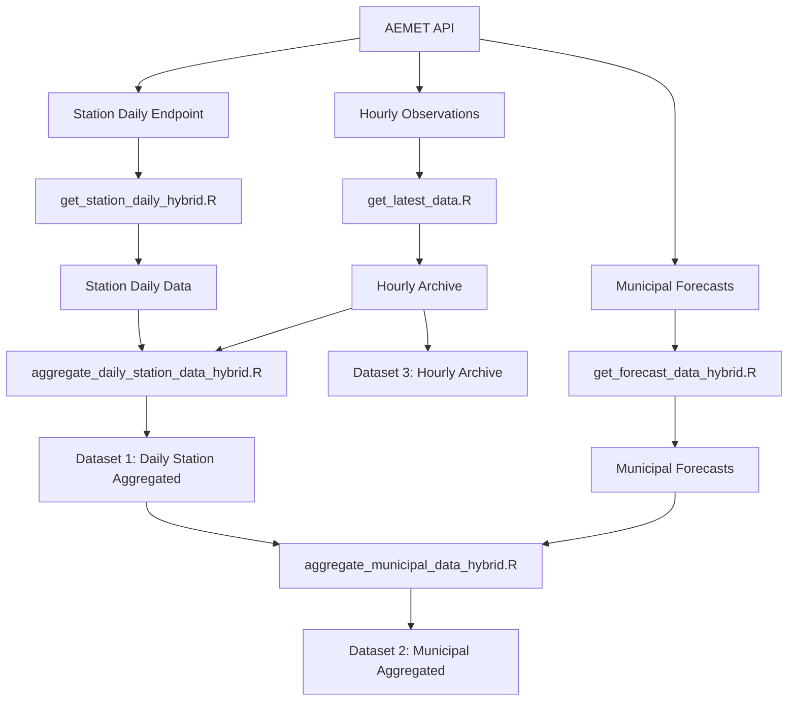

# Spanish Weather Data Collection System

Automated collection and processing of Spanish meteorological data from AEMET (Agencia Estatal de Meteorología) OpenData API.

## Overview

This system collects three standardized weather datasets covering all Spanish weather stations and municipalities:

- **Daily Station Data**: Historical daily measurements from 4,000+ weather stations
- **Municipal Forecasts**: 7-day forecasts for all 8,000+ Spanish municipalities  
- **Hourly Station Data**: High-frequency measurements for recent periods

Data is automatically collected, quality-controlled, and aggregated into standardized CSV files ready for analysis.

## Data Outputs

The system produces three main datasets with standardized variable names:

### 1. `daily_station_historical.csv`
Daily weather measurements from Spanish meteorological stations.

**Key Variables**: `date`, `station_id`, `temp_mean`, `temp_max`, `temp_min`, `precipitation`, `humidity_mean`, `wind_speed`, `pressure_max`, `pressure_min`

**Coverage**: 4,000+ stations across Spain  
**Time Range**: Recent daily observations  
**Update**: Daily at 2 AM

### 2. `daily_municipal_extended.csv`  
Municipal-level weather data combining forecasts with station aggregations.

**Key Variables**: `date`, `municipality_id`, `temp_mean`, `temp_max`, `temp_min`, `humidity_mean`, `wind_speed`

**Coverage**: 8,000+ Spanish municipalities  
**Data Priority**: Station aggregations take precedence over forecasts when both exist  
**Update**: Daily at 2 AM

### 3. `hourly_station_ongoing.csv`
High-frequency station measurements for detailed analysis.

**Key Variables**: `datetime`, `station_id`, `variable_type`, `value`  

**Coverage**: Selected weather stations  
**Update**: Daily at 2 AM

## Data Flow

```
AEMET OpenData API
       ↓
   Data Collection
   (scripts/r/*.R)
       ↓
   Quality Control  
   & Standardization
       ↓
   Municipal Aggregation
   (Station → Municipal)
       ↓
   Final Datasets
   (data/output/*.csv)
```

## Technical Implementation

### Collection System
- **Language**: R with SLURM job scheduling
- **API Access**: AEMET OpenData with rate limiting
- **Performance**: climaemet package provides 48x speedup for municipal forecasts
- **Execution Time**: 2-4 hours total (previously 33+ hours)

### Data Processing
- **Variable Standardization**: English names with documented units
- **Quality Control**: Temperature and precipitation validation
- **Gap Management**: Automatic detection and filling of missing data
- **Municipality Codes**: CUMUN format from AEMET (documented for merge compatibility)

### Automation
- **Daily Collection**: 2:00 AM via SLURM scheduler
- **Gap Filling**: Weekly on Sundays at 1:00 AM  
- **Documentation Updates**: Daily at 6:00 AM

## Getting Started

### Prerequisites
- SLURM HPC environment with R/4.4.2 and GDAL/3.10.0
- AEMET OpenData API key (stored in `auth/keys.R`)
- Required R packages: tidyverse, climaemet, meteospain, data.table

### Installation
1. Clone repository
2. Configure API key in `auth/keys.R`
3. Install crontab automation:
```bash
# Add these lines to crontab -e
0 2 * * * cd /path/to/project && sbatch scripts/bash/update_weather_hybrid.sh
0 6 * * * cd /path/to/project && sbatch scripts/bash/update_readme_summary.sh  
0 1 * * 0 cd /path/to/project && sbatch scripts/bash/fill_gaps.sh
```

### Manual Execution
```bash
# Full data collection
sbatch scripts/bash/update_weather_hybrid.sh

# Gap analysis and filling
sbatch scripts/bash/fill_gaps.sh

# Update documentation
sbatch scripts/bash/update_readme_summary.sh
```

## File Structure

```
scripts/
├── r/              # R collection and analysis scripts
├── bash/           # SLURM job scripts  
└── archive/        # Archived/unused scripts

data/
├── output/         # Final standardized datasets
├── backup/         # Data backups and archives
└── input/          # Reference data (station lists, etc.)

docs/               # Technical documentation
auth/               # API credentials (excluded from git)
logs/               # SLURM job outputs
```

## Variable Documentation

All datasets use standardized English variable names. Municipality IDs use CUMUN codes from AEMET. See `docs/variable_standardization.md` for complete mapping from original AEMET variable names.

## Performance Notes

- **Municipal forecasts**: 48x performance improvement using climaemet package
- **Daily execution**: 2-4 hours total vs 33+ hours with previous approach
- **Data priority**: Station measurements replace forecasts as they become available
- **Gap management**: Prevents redundant historical data collection

## License

GPLv3 License - see LICENSE file for details.
- **Records**: 2,250 station-days
- **Stations**: 838 weather stations
- **Coverage**: 2025-08-17 to 2025-08-25
- **Data Quality**: Coverage analysis pending
- **Latest File**: `daily_station_aggregated_2025-08-25.csv.gz` (0 MB)

### Dataset 2: Municipal Daily Data  
- **Records**: 2,001 municipality-days
- **Municipalities**: 724 municipalities
- **Historical Data**: 1,910 records
- **Forecast Data**: 91 records (7 days coverage)
- **Coverage**: 2025-08-17 to 2025-08-31
- **Data Quality**: Coverage analysis pending
- **Latest File**: `municipal_aggregated_2025-08-25.csv` (0.3 MB)

### Dataset 3: Hourly Station Data
- **Records**: 180,393 hourly observations
- **Stations**: ~752 stations (sample estimate)
- **Variables**: 7 meteorological measures
- **Coverage**: 2025-08-25 to 2025-08-25
- **Recent Activity**: Analysis pending observations (last 30 days)
- **Archive Size**: 0.8 MB compressed

### 🔄 Collection System Status
- **Collection Method**: Hybrid system using `climaemet` package + custom API calls
- **Performance**: ~5.4x faster than previous approach
- **Schedule**: Daily collection at 2 AM via crontab
- **Last Gap Analysis**: Not available

### 📈 Data Growth Tracking
| Dataset | Current Size | Growth Rate | Last Updated |
|---------|-------------|-------------|--------------|
| Station Daily | 0 MB | ~281 records/day | 2025-08-25 |
| Municipal Data | 0.3 MB | ~250 records/day | 2025-08-25 |
| Hourly Archive | 0.8 MB | ~TBD records/day | 2025-08-25 |

---


## Three Output Datasets

### Dataset 1: Daily Station Data
**File**: `daily_station_aggregated_YYYY-MM-DD.csv.gz`

Daily aggregated weather data by station:
- Data sources: AEMET daily climatological endpoint + hourly observations aggregated to daily
- Variables: daily min/max/mean temperature, precipitation, wind, humidity, pressure
- Coverage: Active weather stations across Spain
- Quality control: Temperature range validation, realistic value bounds

### Dataset 2: Municipal Daily Data  
**File**: `municipal_aggregated_YYYY-MM-DD.csv.gz`

Daily weather data by municipality:
- Data sources: Station data aggregated by municipality + 7-day municipal forecasts
- Coverage: 8,129 Spanish municipalities
- Temporal range: Historical station aggregates through 7-day forecasts
- Source tracking: Distinguishes between station-derived data and forecast data

### Dataset 3: Hourly Station Data
**File**: `hourly_station_ongoing.csv.gz`

Hourly observations from AEMET stations:
- Data format: Long format (measure/value pairs) for 7 core variables
- Update frequency: Daily collection with continuous archiving
- Purpose: Building comprehensive historical hourly archive

## Data Collection System

### Collection Methods
- **Station Daily Data**: Custom API calls to AEMET climatological endpoints
- **Municipal Forecasts**: `climaemet` R package for robust API interaction
- **Hourly Data**: Direct API calls to AEMET observational endpoints

### Automation
- **Schedule**: Daily collection via SLURM batch system
- **Gap Detection**: Automated identification of missing data
- **Gap Filling**: Weekly targeted collection for missing records
- **Quality Control**: Automated validation of temperature ranges and data consistency

### Data Processing Pipeline



## File Structure

### Core Collection Scripts
```
code/
├── get_station_daily_hybrid.R        # Station daily data collection
├── get_forecast_data_hybrid.R        # Municipal forecast collection  
├── get_latest_data.R                 # Hourly data collection
├── collect_all_datasets_hybrid.R     # Coordinated collection of all datasets
├── aggregate_daily_station_data_hybrid.R  # Station data aggregation
└── aggregate_municipal_data_hybrid.R      # Municipal data aggregation
```

### Data Quality & Monitoring
```
code/
├── check_data_gaps.R                 # Gap detection and analysis
├── fill_data_gaps.R                  # Targeted gap filling
├── generate_data_summary.R           # Dataset statistics generation
└── update_readme_with_summary.R      # Automated documentation updates
```

### SLURM Integration
```
├── update_weather_hybrid.sh          # Main collection job
└── CRONTAB_LINES_TO_ADD.txt         # Scheduling configuration
```

## Setup and Usage

### Prerequisites
```bash
# Load required modules (HPC environment)
module load GDAL/3.10.0-foss-2024a
module load R/4.4.2-gfbf-2024a

# Install required R packages
Rscript -e "install.packages(c('climaemet', 'tidyverse', 'data.table', 'lubridate'))"
```

### Manual Collection
```bash
# Collect all three datasets
sbatch update_weather_hybrid.sh

# Or run individual components
Rscript code/get_forecast_data_hybrid.R      # Municipal forecasts
Rscript code/get_station_daily_hybrid.R      # Station daily data  
Rscript code/get_latest_data.R               # Hourly data
```

### Automated Schedule
Add these lines to your crontab:
```bash
# Daily collection (2 AM)
0 2 * * * cd /path/to/weather-data-collector-spain && sbatch update_weather_hybrid.sh

# Daily status update (6 AM)  
0 6 * * * cd /path/to/weather-data-collector-spain && Rscript code/update_readme_with_summary.R

# Weekly gap filling (Sunday 1 AM)
0 1 * * 0 cd /path/to/weather-data-collector-spain && Rscript code/fill_data_gaps.R
```

## Data Quality

### Coverage and Success Rates
- **Station Daily**: Typical success rates of 30-50% per collection run (normal for AEMET API)
- **Municipal Forecasts**: 65-95% success rates with automatic retry logic
- **Hourly Data**: >99% success rate for active stations

### Quality Control Measures
- **Temperature validation**: Range checks (min ≤ mean ≤ max, realistic bounds)
- **Duplicate handling**: Automatic deduplication with source prioritization
- **Gap tracking**: Systematic identification and filling of missing data
- **Source attribution**: Clear distinction between observed vs forecast data

## Data Access

### Output Location
All datasets are saved in `data/output/` with date-stamped filenames:
- `daily_station_aggregated_YYYY-MM-DD.csv[.gz]`
- `municipal_aggregated_YYYY-MM-DD.csv[.gz]`  
- `hourly_station_ongoing.csv.gz`

### File Formats
- **CSV format**: Compatible with R, Python, and standard analysis tools
- **Compressed versions**: `.gz` files for efficient storage
- **Consistent schemas**: Standardized column names across collection runs

## Monitoring and Maintenance

### Gap Analysis
```bash
# Check for missing data
Rscript code/check_data_gaps.R

# Fill identified gaps
Rscript code/fill_data_gaps.R
```

### Data Statistics
```bash
# Generate current dataset summary
Rscript code/generate_data_summary.R

# Update README with latest statistics  
Rscript code/update_readme_with_summary.R
```

### Error Handling
- **API Rate Limits**: Automatic detection and waiting
- **SSL Connection Issues**: Built-in retry logic in `climaemet` package
- **Server Errors**: Exponential backoff for temporary failures
- **Missing Data**: Systematic gap detection and targeted re-collection

## Technical Details

### API Integration
- **AEMET OpenData API**: Primary data source requiring valid API key
- **Rate Limiting**: Respectful API usage with automatic throttling
- **Error Recovery**: Robust handling of temporary failures and connection issues

### Dependencies
- **R Packages**: `climaemet`, `tidyverse`, `data.table`, `lubridate`, `httr`, `jsonlite`
- **System Requirements**: GDAL/3.10.0, R/4.4.2
- **Environment**: HPC cluster with SLURM job scheduler

### Performance
- **Collection Time**: Typically 2-4 hours for complete daily collection
- **Resource Usage**: 8GB RAM, single CPU core sufficient
- **Storage Growth**: Approximately 50-100MB per day across all datasets

---

*This system provides reliable, automated collection of comprehensive weather data for Spain with built-in quality control and gap management.*

## Features
- **Real-time Observations**: Fetches current hourly weather from all AEMET stations
- **Historical Data**: Updates and maintains daily historical weather dataset
- **Forecast Collection**: Downloads 7-day municipal forecasts for all 8,129 Spanish municipalities
- **Variable Compatibility**: Uses consistent variables across observation, historical, and forecast data
- **Robust Error Handling**: API rate limits, timeouts, and errors managed with retry logic
- **Concurrent Run Prevention**: Configurable lockfile system prevents script conflicts
- **Data Compression**: All outputs stored in efficient CSV.gz format

## Requirements
- R (recommended version 4.0 or higher)
- API key for AEMET OpenData (see below)
- R packages: tidyverse, lubridate, data.table, curl, jsonlite, RSocrata, R.utils

## Setup
1. **API Key**: Obtain an API key from [AEMET OpenData](https://opendata.aemet.es/centrodedescargas/inicio).
2. **Auth Directory**: Place your API key as `my_api_key` in a file called `keys.R` inside an untracked `auth/` directory:
   ```r
   my_api_key <- "YOUR_API_KEY_HERE"
   ```
3. **Install Dependencies**: Install required R packages if not already present.

## Usage

### Current Weather Observations
- Run `code/get_latest_data_expanded.R` to fetch latest observations with expanded variable set (7 safe variables)
- Original script `code/get_latest_data.R` available for basic 5-variable collection
- Recommended frequency: every 2 hours

### Historical Weather Data  
- Run `code/get_historical_data.R` to update historical daily weather dataset
- Run as needed to maintain historical records

### Forecast Data Collection
- Run `code/get_forecast_data_simple.R` for robust 7-day municipal forecasts (recommended)
- Alternative: `code/get_forecast_data.R` (original enhanced version)
- Configure `SAMPLE_SIZE` for testing (e.g., 20) or `NULL` for all 8,129 municipalities
- See `docs/forecast-collection.md` for detailed configuration

### Data Analysis
- `code/variable_compatibility_analysis.R` - analyzes variable compatibility across endpoints
- `code/aggregate_daily_station_data.R` - processes daily aggregations
- `code/aggregate_municipal_data.R` - municipal-level data processing

All output files are written to the `data/` directory as compressed CSVs.

## Directory Structure
```
weather-data-collector-spain/
├── auth/                  # Untracked directory for API keys
│   └── keys.R
├── code/                  # Main R scripts
│   ├── get_historical_data.R      # Historical daily weather
│   ├── get_latest_data.R          # Basic current observations (5 vars)
│   ├── get_latest_data_expanded.R # Enhanced observations (7 safe vars)
│   ├── get_forecast_data.R        # Municipal forecasts (enhanced)
│   ├── get_forecast_data_simple.R # Municipal forecasts (robust)
│   ├── variable_compatibility_analysis.R # Variable analysis
│   ├── aggregate_daily_station_data.R    # Daily aggregations
│   └── aggregate_municipal_data.R        # Municipal processing
├── data/                  # Output data files
│   ├── spain_weather.csv.gz             # Basic observations (5 vars)
│   ├── spain_weather_expanded.csv.gz    # Enhanced observations (7 vars)
│   ├── spain_weather_daily_historical.csv.gz # Historical daily data
│   ├── municipalities.csv.gz            # All Spanish municipalities (8,129)
│   └── AEMET_variable_documentation.md  # Variable reference
├── docs/                  # Documentation and analysis
│   ├── index.md                         # GitHub Pages site
│   ├── variables.md                     # Variable documentation
│   ├── api-analysis.md                  # API endpoint analysis
│   └── forecast-collection.md           # Forecast system guide
├── logs/                  # Log files and script outputs
├── renv/                  # R environment and package management
├── update_weather.sh      # Shell script for automation
├── update_historical_weather.sh
├── README.md
└── ...
```

## Notes
- The `auth/` directory is not tracked by git for security.
- Scripts are designed to be robust to API failures and rate limits.
- For more details, see comments in each script.

## License
See `LICENSE` file for details.
